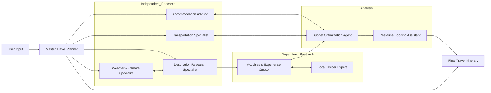

# H2S_AMD - Multi-Agent Travel Planner

`H2S_AMD` is a Python project built with **Agno AgentOS** that generates a complete trip plan using a coordinated set of specialized agents.

It takes a structured travel request (destination, dates, budget, style, companions, etc.) and produces:

- destination and weather research
- accommodation and transport options
- day-by-day activities
- local insider recommendations
- numeric budget optimization with currency conversion
- final booking-oriented itinerary

## Architecture



## Tech Stack

- Python 3.13+
- Agno (`agno[os]`) for AgentOS, Agents, Workflow orchestration
- FastAPI/Uvicorn app serving via AgentOS
- Tavily + Web Search tools for live research
- YFinance + custom currency converter tool for budget computations
- SQLite for workflow session persistence (`tmp/travel.db`)

## Project Structure

```text
.
|- travel_planner.py    # Main multi-agent workflow and FastAPI app
|- main.py              # Minimal entry script
|- pyproject.toml       # Project metadata and dependencies
|- .env.example         # Example API key variables
|- tmp/                 # Local runtime db/output artifacts
```

## Prerequisites

- Python `>=3.13`
- `uv` (recommended package manager/runner)
- API keys for the services used by tools/models

## Environment Variables

Copy `.env.example` to `.env` and set real keys:

```powershell
Copy-Item .env.example .env
```

Required variables:

- `GOOGLE_API_KEY` (OPTIONAL)
- `NVIDIA_API_KEY`
- `TAVILY_API_KEY`
- `RATE_CONVERTER_API_KEY`

## Install

Using `uv`:

```powershell
uv sync
```

If you prefer `pip`, install dependencies listed in `pyproject.toml`.

## Run

Start the AgentOS app:

```powershell
uv run python travel_planner.py
```

Alternative:

```powershell
uv run uvicorn travel_planner:app --reload
```

## Input Schema

The workflow validates input with `TravelRequest` (Pydantic). Fields include:

- `destination`
- `travel_purpose`
- `travel_companions`
- `travel_dates`
- `departure_location`
- `date_flexibility`
- `accommodation_type`
- `budget`
- `interests_activities` (list)
- `travel_style`
- `duration`
- `budget_flexibility`

Example payload:

```json
{
  "destination": "Tokyo, Japan",
  "travel_purpose": "Leisure",
  "travel_companions": "Couple",
  "travel_dates": "2026-04-10 to 2026-04-17",
  "departure_location": "New York, USA",
  "date_flexibility": "Slightly flexible",
  "accommodation_type": "Hotel",
  "budget": "$4500 USD",
  "interests_activities": ["Food tours", "Museums", "Day trips"],
  "travel_style": "Mid-range",
  "duration": "7 days",
  "budget_flexibility": "Moderate"
}
```

## Workflow Steps

1. Independent research (weather, destination, accommodation, transport) in parallel
2. Activities curation
3. Local insights
4. Budget optimization
5. Final itinerary and booking timeline

## Notes

- Currency conversion first uses `RATE_CONVERTER_API_KEY` via UnirateAPI and falls back to YFinance-based FX when needed.
- Session state is stored in SQLite at `tmp/travel.db`.
- `main.py` is currently a placeholder; primary runtime entrypoint is `travel_planner.py`.
